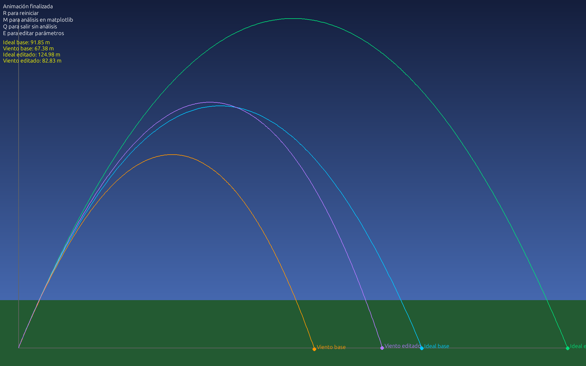
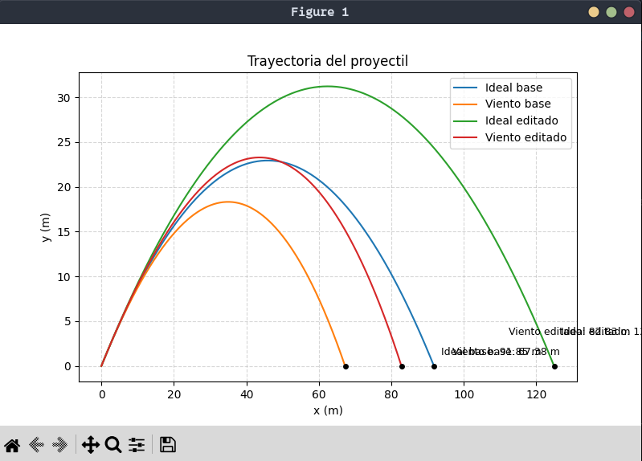
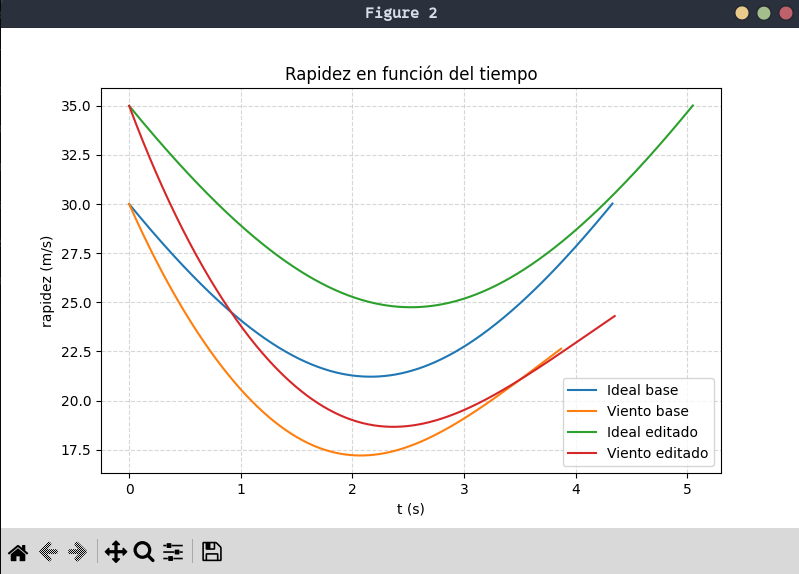
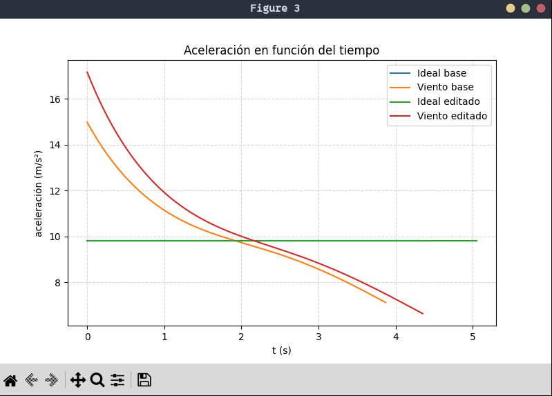

# Parabolic Shot - UM Physics Simulator 

[🇪🇸 Español](#español) | [🇺🇸 English](#english)

---

<a name="español"></a>

## Español

Simulador numérico de tiro parabólico que compara dos escenarios: un caso ideal (solo gravedad) y un caso con resistencia del aire y viento constante. Desarrollado como TFI de Física con Python.



### Objetivos

- Aplicar las ecuaciones de movimiento del tiro parabólico
- Implementar integración numérica (Runge-Kutta 4to orden)
- Comparar el caso ideal contra uno con fuerzas de arrastre
- Visualizar resultados de forma interactiva

### Modelos físicos

Se modelan dos fuerzas sobre el proyectil:

- **Gravedad:** constante, dirección vertical descendente
- **Arrastre aerodinámico:** modelo cuadrático `F = ½ρ·Cd·A·v²`, donde ρ es la densidad del aire, Cd el coeficiente de arrastre, A el área frontal y v la velocidad
- **Viento:** campo de velocidad constante que afecta la trayectoria

### Metodología numérica

La integración se realiza con el método de **Runge-Kutta de 4to orden** (RK4), que ofrece mayor precisión que Euler con el mismo paso de tiempo. También se incluye un integrador Euler como referencia didáctica.

### Instalación

```bash
git clone https://github.com/FranRodeles/Parabolic-shot-UM-physics-simulator.git
cd Parabolic-shot-UM-physics-simulator
python -m venv .venv
source .venv/bin/activate
pip install -r requirements.txt
```

### Uso

```bash
python main.py
```

**Teclas en la animación:**

| Tecla | Acción |
|-------|--------|
| `E` | Modo edición (modificar parámetros) |
| `R` | Reiniciar animación |
| `M` | Abrir gráficos en Matplotlib |
| `Q` | Salir |

Al terminar la animación, los resultados se guardan automáticamente en `assets/simulation_results.json`.

### Arquitectura

```
config/         → Parámetros configurables (dataclasses inmutables)
physics/        → Modelo físico (fuerzas, ecuaciones de movimiento)
numerics/       → Métodos de integración numérica (Euler, RK4)
simulation/     → Orquestador (conecta física + numéricos)
visualization/  → Salida visual (pygame + matplotlib)
main.py         → Punto de entrada
```

### Resultados de ejemplo

| Caso | Alcance | Altura máx. | Tiempo |
|------|---------|-------------|--------|
| Ideal | 91.85 m | 22.94 m | 4.33 s |
| Con viento (5 m/s) | 67.38 m | 18.32 m | 3.87 s |





### Tecnologías

- **Python 3.10+**
- **NumPy** — cálculos numéricos
- **SciPy** — constantes físicas
- **Matplotlib** — gráficos de resultados
- **Pygame** — animación interactiva

---

<a name="english"></a>

## English

Numerical simulator of parabolic projectile motion comparing two scenarios: an ideal case (gravity only) and a case with aerodynamic drag and constant wind. Developed as a Physics final project (TFI) using Python.


### Objectives

- Apply the equations of motion for parabolic projectile
- Implement numerical integration (4th-order Runge-Kutta)
- Compare the ideal case against one with drag forces
- Visualize results interactively

### Physical models

Two forces are modeled on the projectile:

- **Gravity:** constant, vertically downward
- **Aerodynamic drag:** quadratic model `F = ½ρ·Cd·A·v²`, where ρ is air density, Cd the drag coefficient, A the frontal area, and v the velocity
- **Wind:** constant velocity field affecting the trajectory

### Numerical method

Integration is performed using the **4th-order Runge-Kutta** method (RK4), which provides higher accuracy than Euler with the same time step. An Euler integrator is also included as a didactic reference.

### Installation

```bash
git clone https://github.com/FranRodeles/Parabolic-shot-UM-physics-simulator.git
cd Parabolic-shot-UM-physics-simulator
python -m venv .venv
source .venv/bin/activate
pip install -r requirements.txt
```

### Usage

```bash
python main.py
```

**Animation keys:**

| Key | Action |
|-----|--------|
| `E` | Edit mode (modify parameters) |
| `R` | Restart animation |
| `M` | Open Matplotlib graphs |
| `Q` | Quit without graphs |

When the animation ends, results are automatically saved to `assets/simulation_results.json`.

### Architecture

```
config/         → Configurable parameters (immutable dataclasses)
physics/        → Physical model (forces, equations of motion)
numerics/       → Numerical integration methods (Euler, RK4)
simulation/     → Orchestrator (connects physics + numerics)
visualization/  → Visual output (pygame + matplotlib)
main.py         → Entry point
```

### Sample results

| Case | Range | Max height | Time |
|------|-------|------------|------|
| Ideal | 91.85 m | 22.94 m | 4.33 s |
| With wind (5 m/s) | 67.38 m | 18.32 m | 3.87 s |


### Technologies

- **Python 3.10+**
- **NumPy** — numerical computing
- **SciPy** — physical constants
- **Matplotlib** — result plotting
- **Pygame** — interactive animation
